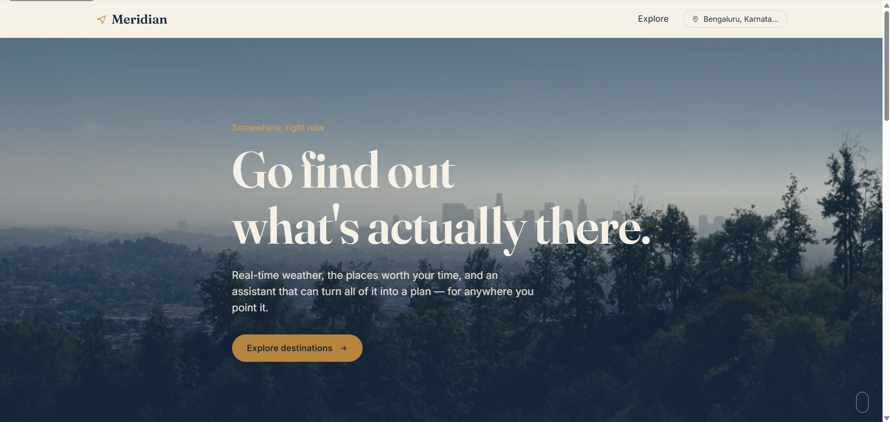
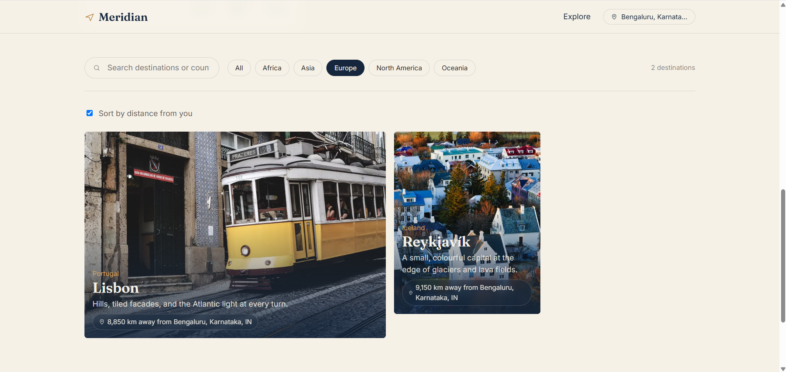

# Meridian — Travel Exploration App

A travel web app for exploring destinations, checking real-time weather, browsing
famous places, and planning a trip with an AI assistant. Built for the Designesthetics
front-end developer assignment.

**Live app:** (https://meridian-travel-gcvzfet7t-kruthikas-projects-889fc7c9.vercel.app/)
**Repository:** https://github.com/kruthika-hegde/meridian--travel-app

## Screenshots

```md



```

## Features

- **Landing hero** — full-bleed looping background video with an orchestrated
  entrance animation.
- **Destination explorer** — search by name/country, filter by region, editorial
  mosaic grid. Each destination opens its own page.
- **Famous places** — presented as an illustrated list with a photo and a note
  per place, not a bare list of names.
- **Location awareness** — a header control lets a visitor share their browser
  location or search for a place manually; the app works either way, and
  denied/unsupported permission states are handled explicitly. Once set, the
  location actually does things: the homepage shows live weather where the
  visitor is, every destination gets a "X km away" badge, and there's a
  "sort by distance" toggle on the explorer. On a destination page, the
  visitor's own weather is shown alongside the destination's for a quick
  comparison.
- **Real-time weather** — live conditions for each destination via OpenWeather,
  with loading, error, and "not configured" states.
- **Images fetched at runtime** — every photo (destination cards, place gallery,
  destination hero) is fetched from Pexels by search query; no image URLs are
  hardcoded in the data.
- **AI chatbot** — a floating assistant (Google Gemini) that answers questions
  about a specific destination — timing, budget, what to see.
- **Itinerary planning** — pick trip length, interests, and pace; the assistant
  returns a structured itinerary rendered as a real day-by-day timeline with
  tabs per day, not a block of chat text.
- **Error/empty/loading states everywhere** — every async piece (weather,
  images, chat, itinerary, geolocation, location search) has its own loading,
  empty, and error UI. Nothing silently breaks. The hero video also falls back
  to a plain gradient if the clip fails to load, instead of a broken frame.
- **Accessibility** — semantic landmarks, a skip link, visible focus rings,
  `aria-live` regions for async updates, form labels, `prefers-reduced-motion`
  support, and full keyboard operability (chat panel, itinerary tabs, filters,
  location picker).
- **Fully responsive** — tested down to a 360px-wide phone viewport up through
  large desktop.

## APIs used

| Purpose | Provider | Notes |
|---|---|---|
| Weather | [OpenWeather](https://openweathermap.org/api) | Current weather + geocoding (location search) |
| Images | [Pexels](https://www.pexels.com/api/) | Destination and place photography, fetched by search query |
| AI assistant + itinerary | [Google Gemini](https://aistudio.google.com/) | `gemini-3.6-flash` via the REST `generateContent` endpoint |
| Hero video | Coverr / Mixkit | Downloaded and self-hosted, see below — not hotlinked |

## Getting started locally

```bash
npm install
cp .env.example .env
# fill in your API keys in .env
npm run dev
```

### API keys

Create free keys for:

1. **OpenWeather** — https://openweathermap.org/api (free tier)
2. **Pexels** — https://www.pexels.com/api/ (free)
3. **Google Gemini** — https://aistudio.google.com/apikey (free tier)

Put them in `.env` (see `.env.example`). `.env` is git-ignored — never commit it.

> **Note on client-side keys:** this is a front-end-only app, so these keys are
> bundled into the client build and are visible to anyone who inspects network
> requests. That's an inherent limitation of a purely client-side app, not a
> config mistake. For a production deployment, put a small serverless proxy
> (e.g. a Vercel/Netlify function) in front of each API and keep the real keys
> server-side only.

### Hero video

The hero expects a file at `public/video/hero.mp4`. Download a royalty-free
looping clip from [Coverr](https://coverr.co) or [Mixkit](https://mixkit.co)
(something aerial/travel — mountains, coastline, a city from above works
well), save it as `public/video/hero.mp4`, and it'll be picked up automatically.

## Deploying

Any static host works (Vercel, Netlify, GitHub Pages). A `vercel.json` with a
catch-all rewrite is included so client-side routes like `/destinations/:id`
don't 404 on refresh or direct load. Three things to remember:

1. Set the same three `VITE_*` environment variables in your host's dashboard
   — they must be present at **build** time, not just runtime.
2. Make sure `public/video/hero.mp4` is committed (or hosted elsewhere and the
   `VIDEO_SRC` in `src/components/hero/Hero.jsx` updated to point at it) —
   large video files are sometimes excluded by default in some CI setups.
3. If deploying to GitHub Pages instead of Vercel/Netlify, you'll need a
   different SPA-routing workaround (`vercel.json` only applies to Vercel).

```bash
npm run build   # outputs to dist/
npm run preview # sanity-check the production build locally
```

## Project structure

```
src/
  api/          fetch wrappers for OpenWeather, Pexels, Gemini
  hooks/        useGeolocation, useWeather, useImage
  context/      LocationContext (shared "where the visitor is")
  data/         seed destination dataset (no image URLs — only search queries)
  components/
    layout/     Header, Footer, LocationControl
    hero/       landing hero with background video
    destinations/  search/filter bar, mosaic grid, card
    destination/   detail-page hero, weather widget, places gallery
    chat/       floating AI chat widget
    itinerary/  planner form + rendered day-by-day timeline
    common/     LoadingState / EmptyState / ErrorState / Skeleton / ErrorBoundary
  pages/        Home, DestinationDetail, NotFound
```

## Design notes

Visual identity is built around cartography rather than a generic travel-blog
look: ink navy + parchment as the base palette, a brass accent standing in for
compass hardware, a deep teal reserved for weather/data readouts. `Fraunces`
carries headlines, `Inter` carries UI text. The itinerary's day timeline and
the header's location pin use the same route-line/marker motif to tie the
"planning a route" idea together visually.

## Known limitations

- API keys are client-side (see note above) — fine for a graded assignment,
  not production-safe as-is.
- Destination and place data is a curated static set (8 destinations); it's
  not pulled from a destinations API, since the brief left data sourcing open.
- The chat assistant has no persistent memory across page reloads.
